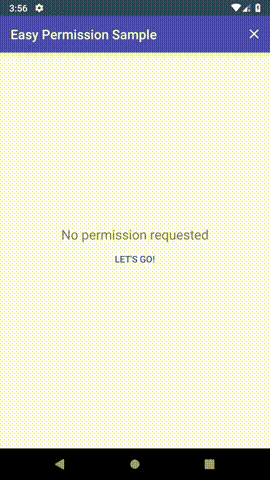

# EzPermission 

A tiny and easy to use kotlin library for managing android runtime permissions

## Gradle setup

Make sure your project includes jcenter in its repositories and add this to build.gradle in app module
  
  	dependencies {
	        implementation 'com.androidisland.ezpermission:ezpermission:0.1.4'
	}

## How to use

It's simple, pass all permissions you want to ask for,
the result will be divided into: granted, denied and permanently denied!

    EzPermission.with(context)
        .permissions(
            Manifest.permission.WRITE_EXTERNAL_STORAGE,
            Manifest.permission.ACCESS_FINE_LOCATION
        )
        .request { granted, denied, permanentlyDenied ->
            //Here you can check results...
        }
## License

    Copyright 2019 Farshad Tahmasbi
    
    Licensed under the Apache License, Version 2.0 (the "License");
    you may not use this file except in compliance with the License.
    You may obtain a copy of the License at
    
       http://www.apache.org/licenses/LICENSE-2.0
    
    Unless required by applicable law or agreed to in writing, software
    distributed under the License is distributed on an "AS IS" BASIS,
    WITHOUT WARRANTIES OR CONDITIONS OF ANY KIND, either express or implied.
    See the License for the specific language governing permissions and
    limitations under the License.    

            
